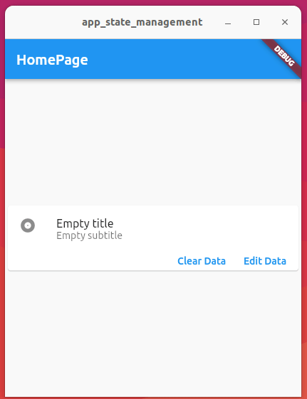

# app_state_management

Project as a case study about Flutter app state. 

## Concepts used in this project

- app state, sending back data from a form
- basic form validation (non-empty string)
- Data object with ChangeNotifier
- Stateless and Stateful widgets

working example:

