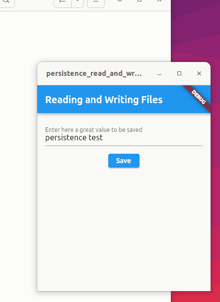

# persistence_read_and_write_files

In some cases, you need to read and write files to disk. For example, you may need to persist data across app launches, or download data from the internet and save it for later offline use.

This project was a study case for writing and reading local files. 

## Dependence

Run this command in project directory:

    flutter pub add path_provider

Working example:

